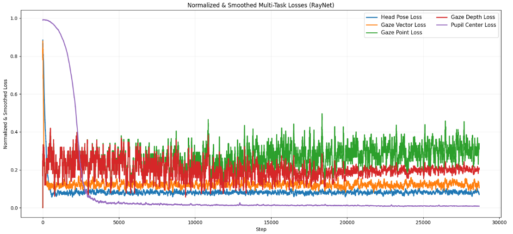

# RayNet v5 — Triple-M1 Multi-Task Gaze Estimation

## Architecture Overview

RayNet v5 is a multi-task architecture for joint gaze estimation, landmark detection, and head pose estimation. It uses three task-specialized RepNeXt-M1 branch encoders sharing a common low-level stem, with MAGE-style bounding box encoding and GazeGene 3D eyeball structure estimation.

```
                        ┌─────────────────────────────────────────────────────────┐
                        │                   RayNet v5 Architecture                │
                        └─────────────────────────────────────────────────────────┘

  Face Image (3, 224, 224)                         Face BBox (x_p, y_p, L_x)
         │                                                  │
         ▼                                                  ▼
  ┌──────────────┐                                  ┌───��──────────┐
  │  SharedStem  │                                  │  BoxEncoder  │
  │  M1 stem +   │                                  │  3→64→128→   │
  │  stage0 (48) │                                  │  256 (MAGE)  │
  │  stage1 (96) │                                  └──────┬───────┘
  └──────��───────┘                                         │
         │                                                 │
    s0 (48ch)  s1 (96ch)                                   │
    56x56      28x28                                       │
         │        │                                        │
         │   ┌────┴────────────────┬───────────────┐       │
         │   │                     │               │       │
         │   ▼                     ▼               ▼       │
         │ ┌─────────┐    ┌─────────────┐   ┌──────────┐  │
         │ │Landmark │    │    Gaze     │   │   Pose   │  │
         │ │ Branch  │    │   Branch    │   │  Branch  │  │
         │ │Encoder  │    │  Encoder    │   │ Encoder  │  │
         │ │M1 s2+s3 │    │  M1 s2+s3  │   │ M1 s2+s3 │  │
         │ └────┬���───┘    └─────┬──────┘   └────┬─────┘  │
         │      │               │               │         │
         │ s2(192) s3(384) s2(192) s3(384)  pose_feat     │
         │  14x14   7x7    14x14   7x7      (256)        │
         │      │               │               │         │
         │      │               │         ┌─────┴────┐    │
         │      │               │         │CoordAtt  │    │
         │      │               │         │Pool→Proj │    │
         │      │               │         └─────┬────┘    │
         │      │               │               │         │
         │      │               │         ┌─────┴─────────┴───┐
         │      │               │         │   FusionBlock     │
         │      │               │         │ pose_feat + bbox  │
         │      │               │         │  (MAGE Sec 3.2)  │
         │      │               │         └────────┬──────────┘
         │      │               │                  │
         │      │               ▼                  │
         │      │         ┌───────────┐            │
         │      │         │ CoordAtt  │            │
         │      │         │ Pool→Proj │            │
         │      │         └─────┬─────┘            │
         │      │               │                  │
         │      │               ▼                  ▼
         │      │         ┌──────────────────────────┐
         │      ├────────►│  PoseGazeModulation      │
         │      │  lm_s2  │  (SHMA sigmoid gating)   │
         │      │         └────────────┬─────────────┘
         │      │                      │
         │      │                      ▼
         │      ├─────────────►┌──────────────────┐
         │      │   lm_s2      │ LandmarkGaze     │
         │      │              │ CrossAttention    │
         │      │              └────────┬─────────┘
         │      │                       │
         │      ▼                       ▼
  ┌──────┴──────────┐         ┌──────────────────┐     ┌──���───────┐
  │   U-Net Decoder │         │ GeometricGaze    │     │ PoseHead │
  │   + AttGates    │         │ Head (GazeGene)  │     │ 6D+3D   │
  │  7→14→28→56     │         │                  │     │          │
  └────────┬────────┘         │ eyeball_fc→(B,3) │     └────┬─────┘
           │                  │ pupil_fc  →(B,3) │          │
           ▼                  │                  │          ▼
  14 landmarks (56x56)        │ optical_axis =   │   6D rotation
  10 iris + 4 pupil           │ norm(pupil-eye)  │   3D translation
                              └────────┬─��───────┘
                                       │
                                       ▼
                              eyeball_center (B,3)
                              pupil_center   (B,3)
                              optical_axis   (B,3) ← derived from geometry
                              gaze_angles    (B,2) ← pitch, yaw
```

### Key Design Decisions

| Decision | Rationale |
|----------|-----------|
| **Triple-M1** (3 separate branch encoders) | Each task gets dedicated stages 2-3, preventing gradient conflict at high-level features while sharing low-level edges/textures via the stem |
| **U-Net decoder** with attention gates | State-of-the-art for dense prediction; skip connections preserve spatial precision lost in deep encoding; attention gates suppress irrelevant skip features |
| **GazeGene 3D eyeball structure** | Predicting eyeball + pupil centers forces anatomically consistent geometry; optical axis is DERIVED not regressed, providing physical grounding |
| **MAGE BoxEncoder** | Eliminates MediaPipe dependency at inference — only a fast face bbox detector needed; encodes face position + scale for gaze origin estimation |
| **Zero-init bridges** | All inter-branch connections start as identity (ControlNet/ReZero pattern), preventing cold-start training collapse |
| **Gradient isolation** for pose | `s1.detach()` prevents pose gradients from steering shared features away from what landmark/gaze need |
| **Pose-conditioned gaze modulation** | SHMA-style sigmoid gating lets gaze branch interpret eye textures relative to head orientation |

### Loss Functions (V5)

GazeGene 3D Eyeball Structure Estimation losses (Sec 4.2.2):

| Loss | Formula | Purpose |
|------|---------|---------|
| **Eyeball center L1** | `L1(pred_eyeball, gt_eyeball)` | Localize eye center in 3D |
| **Pupil center L1** | `L1(pred_pupil, gt_pupil)` | Localize pupil in 3D |
| **Iris contour L1** | Part of landmark loss (10 iris points) | 2D eye structure |
| **Geometric angular** | `angular_error(normalize(pupil-eyeball), gt_axis)` | Geometric consistency |
| **Gaze L1** | `L1(pred_axis, gt_axis)` | Direct gaze supervision |
| **Ray-to-target** | Scale-invariant endpoint constraint | Ties gaze to 3D target |
| **Geodesic pose** | `arccos((tr(R_pred^T R_gt) - 1) / 2)` | SO(3) rotation distance |
| **Translation SmoothL1** | Direct metric in meters | Head position |
| **Landmark heatmap MSE** | Gaussian heatmap + coordinate L1 | Dense spatial supervision |

### Parameters

| Component | Params |
|-----------|--------|
| SharedStem (M1 stem + stages 0-1) | ~1.5M |
| Landmark BranchEncoder (M1 stages 2-3) | ~3.3M |
| Gaze BranchEncoder (M1 stages 2-3) | ~3.3M |
| Pose BranchEncoder (M1 stages 2-3) | ~3.3M |
| U-Net decoder + attention gates | ~0.5M |
| BoxEncoder + FusionBlock | ~0.1M |
| Bridges + heads | ~1.0M |
| **Total** | **~16M** |

### Training Phases

| Phase | Active Components | Loss Weights |
|-------|-------------------|--------------|
| **Stage 1** | Landmark + Pose branches | lam_lm=1.0, lam_pose=1.0, lam_trans=0.5 |
| **Stage 2** | + Gaze branch (bridges zero-init) | + lam_gaze=0.5, lam_eyeball=0.3, lam_pupil=0.3 |
| **Stage 3** | + All bridges + geometric angular | + lam_geom_angular=0.2, lam_ray=0.1 |

### References

- **MAGE** (Sec 3.2): Bounding box encoder + fusion block for gaze origin estimation
- **GazeGene** (Sec 4.2.2): 3D eyeball structure estimation with 4-loss formulation
- **RepNeXt-M1**: embed_dim=(48, 96, 192, 384), depth=(2, 2, 6, 2)
- **SixDRepNet**: 6D continuous rotation representation (Zhou et al., CVPR 2019)
- **Attention U-Net**: Oktay et al., 2018 — attention gates for skip connections

---
---

# Legacy Documentation (v1-v3)

## RayNet: GazeGene Dataset Loader & Multi-View Sampler

This module provides PyTorch Dataset and Sampler classes for the GazeGene synthetic gaze estimation dataset, 
as used in RayNet. It is designed for efficient, balanced, multi-camera training of deep gaze models.

Main Features:
--------------
- Loads images, mesh, gaze, headpose, and camera info from GazeGene directory structure.
- Returns samples as PyTorch tensors for direct use with RepNeXt and BiFPN backbones.
- Supports selecting a subset of frames per subject for faster experiments.
- Provides balanced sampling over subject attributes (e.g., ethnicity, gender, eye color).
- Provides multi-view batches: each batch contains all 9 camera views for a single (subject, frame).

-----------------------------------------------------------------------------------
GazeGeneDataset
-----------------------------------------------------------------------------------

class GazeGeneDataset(torch.utils.data.Dataset):
    """
    PyTorch Dataset for GazeGene synthetic gaze estimation dataset.

    Args:
        base_dir (str): Path to GazeGene_FaceCrops directory.
        subject_ids (list, optional): List of subject IDs to include (e.g., ['subject1', ...]).
        camera_ids (list, optional): List of camera indices (0-8) to include. Default: all 9.
        samples_per_subject (int, optional): Number of unique frames per subject to load. 
                                             If None, loads all frames.
        transform (callable, optional): Optional transform to be applied on images.
        balance_attributes (list, optional): List of attribute names (e.g., ['ethicity', 'gender'])
                                             for balanced sampling.
        seed (int): Random seed for reproducible sampling.

    Returns:
        Each __getitem__ returns a dict with:
            'img'        : Image tensor [3, H, W]
            'subject'    : Subject numeric ID
            'camera'     : Camera index (0-8)
            'frame_idx'  : Frame index within subject
            'mesh'       : Dict of mesh tensors (eyeball_center_3D, pupil_center_3D, iris_mesh_3D)
            'gaze'       : Dict of gaze vectors (gaze_C, visual_axis_L/R, optic_axis_L/R)
            'gaze_point' : 3D gaze point (if available)
            'head_pose'  : Dict of rotation matrix 'R' and translation 't'
            'intrinsic'  : Intrinsic camera matrix for cropped image
            'attributes' : Subject-level attributes (ethnicity, gender, etc.)
    """

-----------------------------------------------------------------------------------
MultiViewBatchSampler
-----------------------------------------------------------------------------------

class MultiViewBatchSampler(torch.utils.data.Sampler):
    """
    Custom batch sampler for multi-camera training.

    Each batch consists of all 9 camera views for a given (subject, frame_idx).
    Optionally balances sampling over subject attributes, for robust, unbiased training.

    Args:
        dataset (GazeGeneDataset): The dataset instance.
        balance_attributes (list, optional): List of attribute names for balanced grouping.
        shuffle (bool): Whether to shuffle batches each epoch.

    Yields:
        List of 9 indices (one per camera) for a single (subject, frame_idx).
    """

-----------------------------------------------------------------------------------
Example Usage
-----------------------------------------------------------------------------------

```python
from torch.utils.data import DataLoader

# Initialize dataset (50 random frames per subject, balance by ethnicity)
dataset = GazeGeneDataset(
    base_dir='./GazeGene_FaceCrops',
    samples_per_subject=50,
    transform=None,               # or torchvision transforms
    balance_attributes=['ethicity']
)

# Initialize multi-view sampler and loader
batch_sampler = MultiViewBatchSampler(dataset, balance_attributes=['ethicity'], shuffle=True)
loader = DataLoader(dataset, batch_sampler=batch_sampler, num_workers=4)

# Iterate over batches
for batch in loader:
    # batch['img'] is a list of 9 tensors [3, H, W] (all camera views)
    # batch['gaze']['gaze_C'] is a list of 9 vectors
    print(batch['img'][0].shape, batch['gaze']['gaze_C'][0])
    break


```
Absolutely! Here’s a **ready-to-paste Markdown documentation** for your **PANet** and **RayNet** modules, including channel mapping, theoretical background, and input/output details.

---

# RayNet Architecture Documentation

## Overview

**RayNet** is a modular neural network architecture for robust eye gaze, head pose, and eye mesh estimation.
It combines a deep, efficient **RepNeXt** backbone (flexible size), with a **YOLOv8-style PANet** for powerful multi-scale feature fusion.
This design enables detailed local (eye) and contextual (face, head) understanding for multi-task learning.

---

## Table of Contents

1. [RayNet Architecture](#raynet-architecture)
2. [RepNeXt Backbone](#repnext-backbone)
3. [PANet Neck](#panet-neck)
4. [Channel & Feature Size Mapping](#channel--feature-size-mapping)
5. [Input/Output Example](#inputoutput-example)
6. [Theory and Design Rationale](#theory-and-design-rationale)
7. [Usage Example](#usage-example)

---

## RayNet Architecture

* **Backbone:** RepNeXt (choose from m0-m5, various widths and depths)
* **Neck:** PANet (Path Aggregation Network, YOLOv8-style)
* **Multi-task heads:** (to be defined) for gaze, head pose, and mesh estimation.

```
Input (3x448x448) 
   │
RepNeXt backbone (4 stages)
   ├── C1: stride=4  (high-res, low semantic, e.g., eyes)
   ├── C2: stride=8
   ├── C3: stride=16
   └── C4: stride=32 (low-res, high semantic, e.g., head/global)
   │
PANet (lateral, top-down, bottom-up fusion)
   └── Outputs P2, P3, P4, P5: multi-scale, unified-channel features
```

---

## RepNeXt Backbone

The **RepNeXt** backbone is a scalable convolutional network.
You can select from different model sizes (m0, m1, ..., m5) to trade off between speed and accuracy.

| Model       | C1 | C2  | C3  | C4  |
| ----------- | -- | --- | --- | --- |
| repnext\_m0 | 40 | 80  | 160 | 320 |
| repnext\_m1 | 48 | 96  | 192 | 384 |
| repnext\_m2 | 56 | 112 | 224 | 448 |
| repnext\_m3 | 64 | 128 | 256 | 512 |
| repnext\_m4 | 64 | 128 | 256 | 512 |
| repnext\_m5 | 80 | 160 | 320 | 640 |

* **C1–C4:** Feature maps at four different resolutions, extracted after each major backbone stage.

---

## PANet Neck

**PANet** (Path Aggregation Network) is used for fusing multi-scale features.

* **Lateral 1x1 conv:** Unifies all backbone outputs to the same number of channels (e.g., 256).
* **Top-down fusion:** Passes global, semantic context to high-resolution features (fine detail).
* **Bottom-up fusion:** Brings detail from high-res features into coarser features (robust context).

> **References:**
>
> * Liu et al., ["Path Aggregation Network for Instance Segmentation"](https://arxiv.org/abs/1803.01534)
> * [YOLOv8 PANet implementation](https://docs.ultralytics.com/models/yolov8/#architecture)

---

## Channel & Feature Size Mapping

**Assuming input image size 448×448**:

| Layer       | Channels      | Feature Size | Stride |
| ----------- | ------------- | ------------ | ------ |
| Input       | 3             | 448×448      | 1      |
| C1 (stage0) | e.g. 64       | 112×112      | 4      |
| C2 (stage1) | e.g. 128      | 56×56        | 8      |
| C3 (stage2) | e.g. 256      | 28×28        | 16     |
| C4 (stage3) | e.g. 512      | 14×14        | 32     |
| PANet P2    | 256 (default) | 112×112      | 4      |
| PANet P3    | 256           | 56×56        | 8      |
| PANet P4    | 256           | 28×28        | 16     |
| PANet P5    | 256           | 14×14        | 32     |

* Channels per stage change depending on RepNeXt version (see [RepNeXt Backbone](#repnext-backbone)).
* **PANet always outputs the same number of channels per scale** (default: 256).

---

## Input/Output Example

**Example with repnext\_m3 and input \[B, 3, 448, 448]:**

```python
features = model(x)
for idx, f in enumerate(features):
    print(f"PANet output P{idx+2}: {f.shape}")
```

**Outputs:**

```
PANet output P2: torch.Size([B, 256, 112, 112])
PANet output P3: torch.Size([B, 256, 56, 56])
PANet output P4: torch.Size([B, 256, 28, 28])
PANet output P5: torch.Size([B, 256, 14, 14])
```

---

# RayNet: Multi-Task Gaze and Head Pose Estimation Pipeline

## Overview

**RayNet** is a modular deep learning framework for joint estimation of head pose, gaze vector/point, and eye mesh from multi-view face images.  
This documentation details the mid/high-level pipeline **from PANet fusion onwards**, up to the state-of-the-art head pose regression head, including key architectural components and channel mapping.

---

## Architectural Blocks

### 1. PANet Feature Pyramid

**PANet** (Path Aggregation Network) is used to fuse multi-scale feature maps from a backbone (e.g., RepNeXt) into four outputs: P2, P3, P4, P5.

- **Inputs:** Backbone features `[C2, C3, C4, C5]` (from highest to lowest resolution).
- **Output Channels:** All PANet outputs are set to a unified channel size (default: 256).
- **Purpose:** Multi-scale context aggregation for downstream tasks.

#### Output Shapes (Example: 448x448 input, PANet out_channels=256)
- P2: `[B, 256, 112, 112]`
- P3: `[B, 256, 56, 56]`
- P4: `[B, 256, 28, 28]`
- P5: `[B, 256, 14, 14]`

---

### 2. Multi-Scale Fusion

**MultiScaleFusion** module fuses the outputs `[P2, P3, P4, P5]` to produce a single, spatially aligned feature map. This step is essential for:
- **Capturing both fine and coarse information** across all scales.
- **Preparing a unified tensor** for subsequent attention and regression heads.

#### Typical Fusion Procedure

1. **Upsample all PANet outputs to P2 resolution** (`112x112`).
2. **Concatenate along channel dimension** (result: `[B, 4*256, 112, 112]`).
3. **Reduce to 256 channels** via a 1x1 convolution (optional BatchNorm + activation).

### Fusion Example

```python
# fusion = MultiScaleFusion(in_channels=256, n_scales=4, out_channels=256)
fused = fusion([P2, P3, P4, P5])  # [B, 256, 112, 112]
```
---

### 3. Coordinate Attention

After fusion, **Coordinate Attention** (CoordAtt) is applied to further enhance the feature representation by encoding precise spatial information efficiently.

- **CoordAtt module** is lightweight, mobile-friendly, and boosts spatial selectivity.
- The attention module is applied *before* each task-specific head (here: head pose).

---

## Head Pose Regression

### Location

- **Implementation:** `head_pose/model.py`
- **Loss function:** `head_pose/loss.py` (Geodesic loss)

### Description

This regression head takes the fused, coordinate-attended feature map and regresses to a 6D representation of the rotation matrix, which is later converted to a full 3x3 rotation matrix for loss computation.

#### Architecture

1. **CoordAtt:** Processes `[B, 256, 112, 112]` → `[B, 256, 112, 112]`.
2. **AdaptiveAvgPool2d:** Pools to `[B, 256, 1, 1]`.
3. **MLP:** 
    - FC1: `[B, 256] → [B, 128]`
    - ReLU
    - FC2: `[B, 128] → [B, 6]`
4. **Output:** `[B, 6]`  (6D representation for rotation, robust for regression)

#### Conversion and Loss

- **During training**: Convert `[B, 6]` → `[B, 3, 3]` via `compute_rotation_matrix_from_ortho6d`.
- **Loss**: Use **Geodesic Loss** (minimizes angle between predicted and ground truth rotation matrices).

---


## Gaze Vector Regression

### Location

- **Implementation:** `gaze_vector/model.py`
- **Loss function:** `gaze_vector/loss.py` (Geodesic loss)

### Description

The **Gaze Vector Head** in RayNet is designed for efficient, multi-view, calibration-free gaze direction estimation. It leverages state-of-the-art neural rotation representations and loss functions, and is fully compatible with the GazeGene dataset and multi-task MGDA training.

---

## Architecture

* **Input:**
  Fused multi-scale feature maps (`[B, C, H, W]`) from RayNet’s backbone and PANet.
* **Coordinate Attention:**
  Efficiently highlights spatial and channel-wise information for robust directionality (see `coordatt.py`).
* **MLP Regression:**
  Coordinate-attended features are globally pooled and regressed via an MLP to a **6D rotation representation** (see below).
* **Output:**
  Each sample yields a 6D vector per view; convertible to a 3×3 rotation matrix using the `compute_rotation_matrix_from_ortho6d` utility.

*For detailed code, see:*
[`gaze_vector/model.py`](./head_gaze/model.py)

---

## 6D Rotation Representation

* We use the **6D representation of rotations** (Zhou et al., ECCV 2019), which is:

  * Continuous
  * Unique
  * Free from ambiguities of Euler angles or quaternions
* The 6D vector is converted to a rotation matrix (`3×3`) before loss calculation, ensuring geometric correctness.

---

## Loss Function

* **Geodesic Loss on SO(3):**

  * Computes the angular distance between predicted and ground-truth gaze rotations.
  * This is more meaningful for 3D orientation than L2 or cosine loss.
* **Multi-View Loss Structure (MGDA-ready):**

  * **Accuracy Loss:** Per-view geodesic error between each prediction and its ground truth.
  * **Consistency Loss:** Geodesic error between each view’s prediction and the mean prediction across all 9 views (enforcing multi-view consistency).

*For implementation, see:*
[`gaze_vector/loss.py`](./head_gaze/loss.py)

---


## Gaze Point Regression

### Location

* **Implementation:** `gaze_point/model.py`
* **Loss function:** `gaze_point/loss.py` (Multi-view L2 loss)

### Description

The **Gaze Point Head** in RayNet predicts the 3D intersection point of the gaze ray in camera space. It is optimized for calibration-free, multi-view gaze estimation, fully leveraging the rich geometry of the GazeGene dataset. The design enables direct regression of gaze intersection points in 3D space, supporting robust multi-task training and downstream applications like gaze-based UX or AR/VR annotation.

---

## Architecture

* **Input:**
  Fused multi-scale feature maps (`[B, C, H, W]`) from RayNet’s backbone and PANet.
* **Coordinate Attention:**
  Uses coordinate attention (`CoordAtt`) to efficiently aggregate spatial and channel cues relevant for accurate 3D localization (see `coordatt.py`).
* **MLP Regression:**
  The attended feature vector is globally pooled and regressed via an MLP to a 3D gaze point (`[x, y, z]`).
* **Output:**
  Each sample (or view) yields a **3D point in camera coordinates**.

*For detailed code, see:*
[`gaze_point/model.py`](./gaze_point/model.py)

---

## Loss Function

* **Multi-View L2 (Euclidean) Loss:**

  * **Accuracy Loss:** Per-view Euclidean distance between each predicted gaze point and its ground truth.
  * **Consistency Loss:** Euclidean distance between each view’s prediction and the mean prediction across all 9 views (enforcing geometric consistency in 3D space).
* **MGDA-Ready:**
  Both losses are compatible with multi-task optimization (MGDA), allowing for joint and balanced learning with head pose and gaze direction.

*For implementation, see:*
[`gaze_point/loss.py`](./gaze_point/loss.py)

---

## Dataset Compatibility

* **GazeGene Format:**

  * Ground truth for each sample is a 3D point (`gaze_point` field) in **camera coordinates**.
  * When using the `MultiViewBatchSampler`, both predictions and ground truth will be in `[B, 9, 3]` format for easy, batch-wise, multi-view loss computation.

---

## Theoretical Rationale

* The use of **L2 loss in 3D space** directly optimizes the endpoint error, which is the standard metric for point-based gaze estimation in modern datasets (e.g., ETH-XGaze, Gaze360).
* **Multi-view consistency loss** ensures predictions from all camera views converge to a common intersection point, leveraging the multi-camera structure of GazeGene for better generalization and robustness.
* **Coordinate Attention** ensures the model is spatially aware and efficient, making the head lightweight and well-suited for mobile inference.

---


## Dataset Compatibility

* **GazeGene Format:**

  * Ground truth for each sample is a normalized 3D gaze vector (`gaze_C`).
  * For loss calculation, this vector is converted to a rotation matrix using a canonical frame, ensuring predictions and targets are always compared in **3D camera coordinates**.

    


---

## Pupil Center Regression

### Location

* **Implementation:**%run RayNet/train.py \
    --base_dir ../GazeGene_FaceCrops \
    --samples_per_subject 200 \
    --epochs 30 \
    --checkpoint_freq 5 \
    --log_csv ./logs \
    --checkpoint_dir /content/drive/MyDrive/RayNet_checkpoints \
    --batch_size 3 \
    --num_workers 16 \
    --plot_live \
    --split train \
    --weight_path ../repnext_m3_pretrained.pt `pupil_center/model.py`
* **Loss function:** `pupil_center/loss.py` (Multi-view L2/MSE loss)

---

### Description

The **Pupil Center Head** in RayNet predicts the 3D location of both left and right pupil centers from fused multi-scale feature maps. It is designed for efficient, multi-view, calibration-free inference, fully compatible with the GazeGene dataset and MGDA-based multi-task learning.

---

## Architecture

* **Input:**

  * Fused multi-scale feature maps (`[B, C, H, W]`) from RayNet’s backbone and PANet.
* **Coordinate Attention:**

  * Efficiently encodes spatial and channel-wise cues (see `coordatt.py`).
* **MLP Regression:**

  * Features are globally pooled, then mapped via an MLP to a 6D vector (3D for each eye).
* **Output:**

  * Each sample yields a `[2, 3]` tensor: left and right pupil centers in 3D camera coordinates.

*For detailed code, see:*
[`pupil_center/model.py`](./pupil_center/model.py)

---

## Output Format

* **Predicted:**
  `[B, 2, 3]` for single-view, `[B, 9, 2, 3]` for multi-view batches
* **Target (GazeGene):**
  `'pupil_center_3D'` field, shape `[2, 3]` (left/right eye, 3D)

---

## Loss Function

* **Multi-View L2 Loss:**

  * **Accuracy:**

    * Computes MSE (Euclidean) error for each view’s prediction to the ground truth.
  * **Consistency:**

    * Computes the error between each view’s prediction and the mean prediction across all views (enforces multi-view consistency).
  * Fully MGDA-ready (losses provided as a dictionary).

*For implementation, see:*
[`pupil_center/loss.py`](./pupil_center/loss.py)

---

## Dataset Compatibility

* **GazeGene Format:**

  * Ground truth for each sample is `pupil_center_3D` (per eye, in 3D camera coordinates).
  * Compatible with both single-view and multi-view (all 9 cameras) training strategies.
  * Outputs are in a fully abstracted, camera-centric 3D space, suitable for further geometric operations or visualization.

---
### Results 
## Experiment 1 
We trained the RayNet model on the GazeGene dataset with the following parameters on Google Colab Pro T4 GPU:  

```bash
%run RayNet/train.py \
    --base_dir ../GazeGene_FaceCrops \
    --samples_per_subject 200 \
    --epochs 30 \
    --checkpoint_freq 5 \
    --log_csv ./logs \
    --checkpoint_dir /content/drive/MyDrive/RayNet_checkpoints \
    --batch_size 3 \
    --num_workers 16 \
    --plot_live \
    --split train \
    --weight_path ../repnext_m3_pretrained.pt
```
Normalized training loss of the these tasks:
- Gaze Vector
- Gaze Point
- Gaze Depth
- Head Pose
- Pupil Center

The fluctuations observed in gaze depth and gaze point tasks shows that there are not enough visual cues to traing these regresion head properlu since it conflicts with
other tasks. Pupil center regression has the fastest convergence rate compared to others and apparently could be compatible with head pose and 
gaze vector tasks. 

The hypothesis is that we have to breakdown the single backbone model into smaller models that have compatible tasks in this case 
we for the next experiment we will modify the RayNet architecture to learn pupil center, head pose and gaze vector toegther, therefore depding on 
how well they can perform we would freeze the model to feed the output to a second model responsible for ray reconstruction. 

We have used Gradnorm to calculate optimized weights.

---
## Theory and Design Rationale

* **Why multi-scale features?**

  * Tasks like gaze and mesh estimation need fine detail (P2), while head pose benefits from global context (P5).
  * PANet allows learning at all scales, improving robustness and accuracy.

* **Why unify channels?**

  * Different backbone stages have different channel widths; PANet uses 1x1 conv to align them for addition and fusion.

* **Why top-down & bottom-up?**

  * Top-down: passes semantic info to details.
  * Bottom-up: reinforces context and details at all scales.

---

## Usage Example

```python
from raynet import RayNet

# Create the model (choose backbone size)
model = RayNet(backbone_name='repnext_m3', pretrained=False)
model = model.cuda()  # or .to(device)

# Dummy input
x = torch.randn(2, 3, 448, 448).cuda()
features = model(x)

# features: list of 4 tensors (P2-P5), each [B, 256, H, W]
for idx, f in enumerate(features):
    print(f"PANet output P{idx+2}: {f.shape}")
```

---

## Downstream Multi-Task Heads

The four output feature maps (P2-P5) can be passed to custom task-specific heads for:

* **Gaze vector & gaze point regression**
* **Head pose estimation**
* **Eye mesh (vertex regression or heatmap)**

Simply add separate head modules to the RayNet model as required.


---

## Extending to Other RepNeXt Variants

To use a different backbone (e.g., `repnext_m5`), change:

```python
model = RayNet('repnext_m5', pretrained=False)
```

All PANet fusion logic adapts automatically to the channel widths of your selected RepNeXt variant.

---

## References

* [Path Aggregation Network for Instance Segmentation](https://arxiv.org/abs/1803.01534)
* [YOLOv8 Model Architecture](https://docs.ultralytics.com/models/yolov8/#architecture)
* [RepNeXt: RepVGG-style next generation ConvNets](https://github.com/slightech-research/RepNeXt)

---

**Author:** *Farzad Rahim Khanian*

---
## License