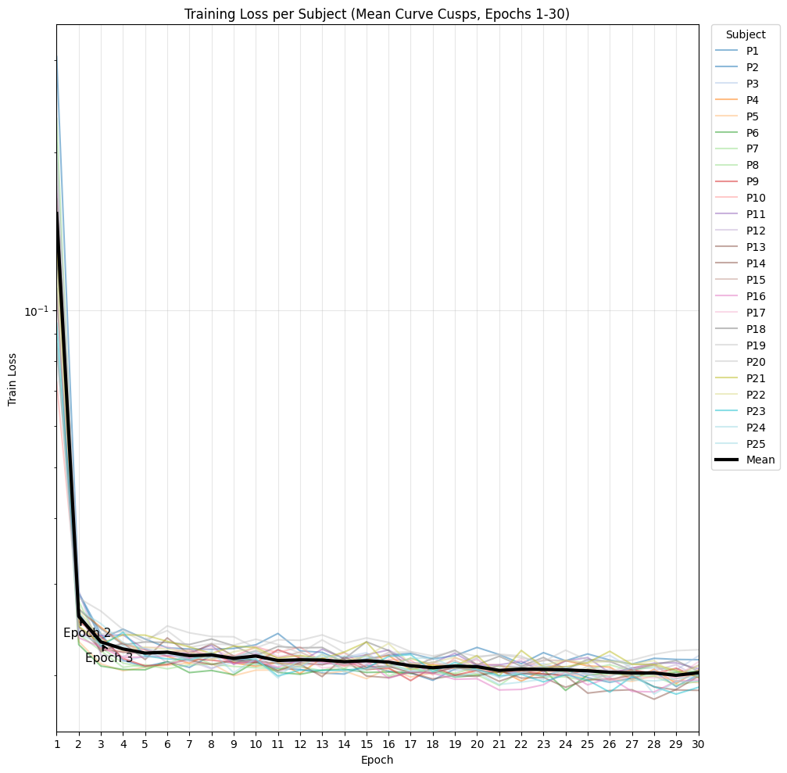
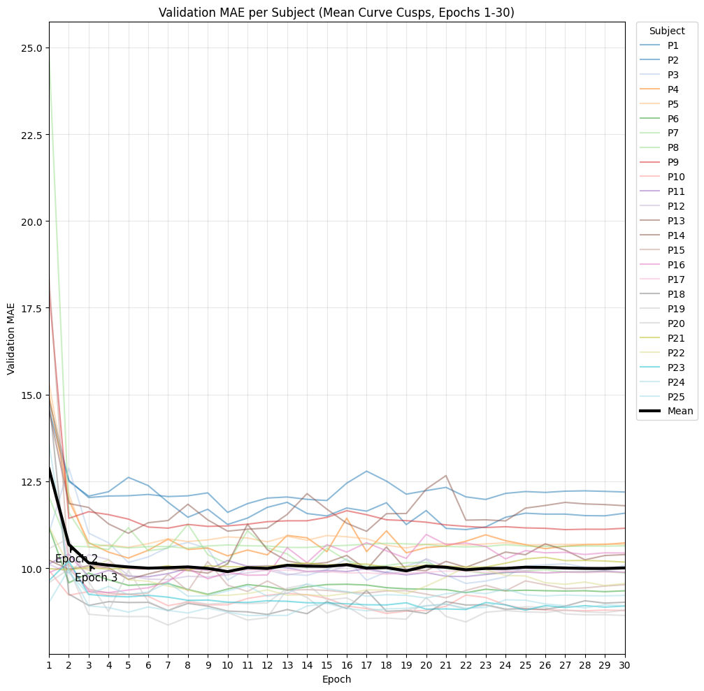
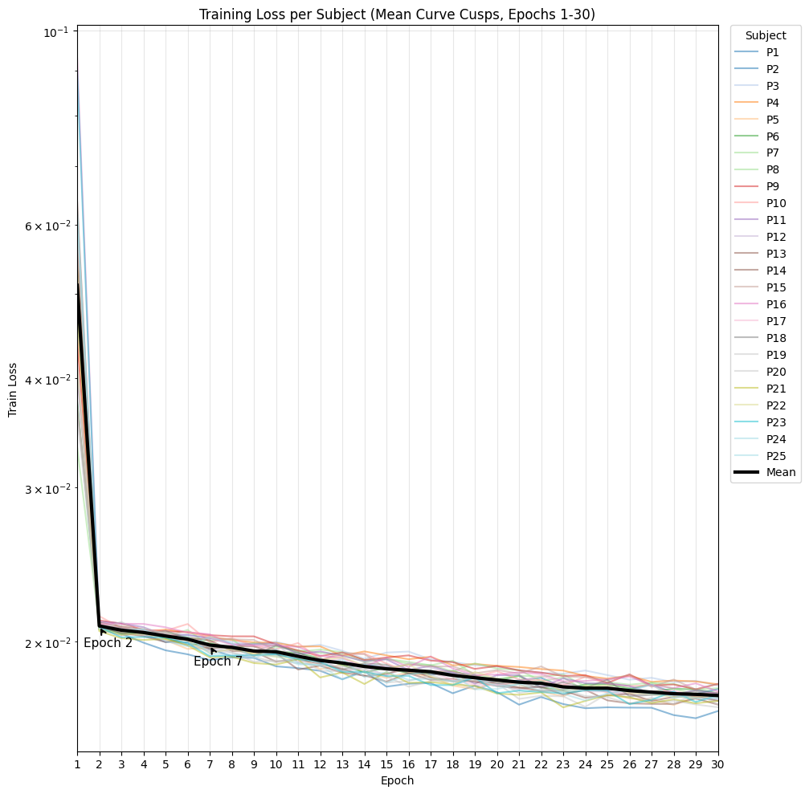
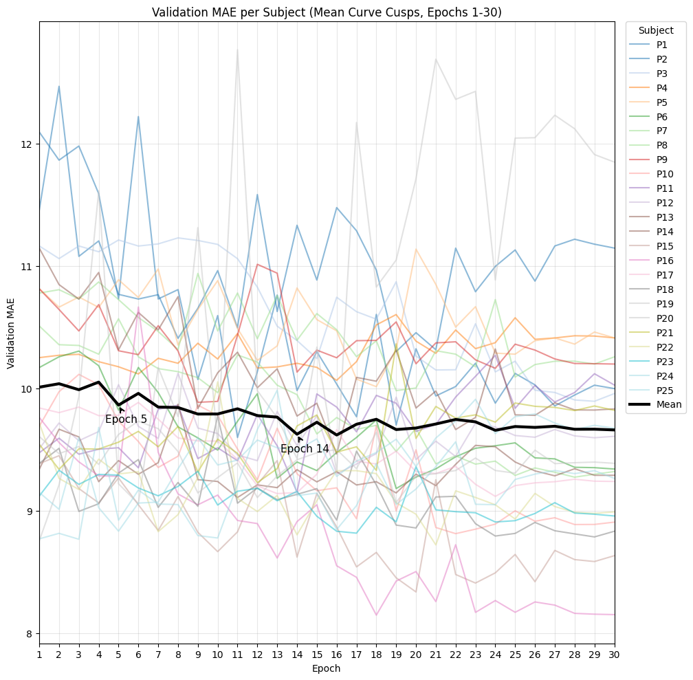

# ARGaze-RepNeXt: Gaze Estimation with RepNeXt Backbone on the ARGaze Dataset

This repository contains code for **gaze estimation** using the [ARGaze dataset](https://arxiv.org/abs/2207.02541) and [RepNeXt](https://arxiv.org/abs/2205.15018) backbone. The code is modular, supporting various training and evaluation methods including **LOSO cross-validation** and standard training/testing splits.

---

## Table of Contents
- [Overview](#overview)
- [Repository Structure](#repository-structure)
- [Getting Started](#getting-started)
- [Dataset: ARGaze](#dataset-argaze)
- [Model: RepNeXt Backbone](#model-repnext-backbone)
- [Training](#training)
- [Testing/Evaluation](#testingevaluation)
- [Logging and Results](#logging-and-results)
- [File Organization & Naming Conventions](#file-organization--naming-conventions)
- [Citations](#citations)
- [Acknowledgements](#acknowledgements)
- [References](#references)

---

## Overview

- **ARGaze-RepNeXt** is designed for efficient and reproducible eye gaze estimation using deep learning.
- Modular codebase: easy to swap models, datasets, training strategies.
- Main backbone: [RepNeXt](https://arxiv.org/abs/2205.15018) (2022).
- Dataset: [ARGaze](https://arxiv.org/abs/2207.02541) (2022).

---

## Repository Structure

```
ARGaze-RepNeXt/
│
├── dataset.py         # Dataset loader for ARGaze
├── transforms.py      # Training and testing transforms
├── losses.py          # Custom losses and metrics
├── utils.py           # Helper functions (e.g., BN fusion)
├── train.py           # Training logic and scripts (LOSO and standard)
├── test.py            # Testing/evaluation script
├── config.py          # Centralized configuration
├── repnext.py         # RepNeXt model implementation
├── requirements.txt   # Python dependencies
├── README.md
└── ARGaze_logs/       # Training/validation logs and checkpoints (created during training)

```

---

## Getting Started

### 1. **Clone the Repository**
```bash
git clone https://github.com/yourusername/ARGaze-RepNeXt.git
cd ARGaze-RepNeXt
```

### 2. **Install Requirements**

```bash
pip install -r requirements.txt
```

### 3. **Download the ARGaze Dataset**

* **Official website:** [ARGaze Dataset](https://github.com/CSG-UESTC/ARGaze)
* Please follow their license and citation requirements.
* Place the extracted data under `./dataset/ARGaze/`

### 4. **Pretrained RepNeXt Weights**

* Download RepNeXt pretrained weights and place under the root directory as `repnext_m3_pretrained.pt` (see [RepNeXt repo](https://github.com/DingXiaoH/RepNeXt-pytorch) for details).

---

## Dataset: ARGaze

* **Citation:**

  > Wu, X., Liu, J., Sun, W., Dong, W., & Wang, X. (2022).
  > **ARGaze: A Large-Scale Gaze Dataset with Angular Resolution and Gaze Estimation Baselines**.
  > *arXiv preprint arXiv:2207.02541*.
  > [Paper link](https://arxiv.org/abs/2207.02541)

* **Structure:**
  Each subject has multiple sessions, each containing images and a `target.npy` of gaze labels.

---

## Model: RepNeXt Backbone

Our implementation uses a RepNeXt-based architecture with the following key features:

- Multiple model sizes available (m0-m5)
- Pretrained on ImageNet
- Outputs 6D rotation representation for gaze estimation
- Optimized for few-shot learning scenarios

### Pretrained Models

We provide pretrained models from our experiments on Hugging Face Hub:

#### Available Models

| Model | Training Samples | Test MAE | Link |
|-------|------------------|----------|------|
| RepNeXt M3 | 200 samples/subject | 10.003739° | [Download](https://huggingface.co/phorosyne/6DRepNet-RepNeXt-M3-ARGaze/resolve/main/experiment_1_200samples_P17_epoch30.pth) |
| RepNeXt M3 | 2000 samples/subject | 9.660695° | [Download](https://huggingface.co/phorosyne/6DRepNet-RepNeXt-M3-ARGaze/resolve/main/experiment_2_2000samples_P12_epoch30.pth) |

### Loading a Pretrained Model

```python
import torch
from backbone.repnext import repnext_m3

# Initialize model
model = repnext_m3(pretrained=False, num_classes=6)

# Load pretrained weights
checkpoint = torch.load('path_to_downloaded_model.pth')
model.load_state_dict(checkpoint['model_state_dict'])
model.eval()
```

### Using the Model for Inference

```python
import torch
from torchvision import transforms
from PIL import Image

def preprocess_image(image_path):
    transform = transforms.Compose([
        transforms.Resize((224, 224)),
        transforms.ToTensor(),
        transforms.Normalize(mean=[0.485, 0.456, 0.406], 
                           std=[0.229, 0.224, 0.225])
    ])
    image = Image.open(image_path).convert('RGB')
    return transform(image).unsqueeze(0)

# Prepare input
input_tensor = preprocess_image('path_to_eye_image.jpg')

# Get prediction
with torch.no_grad():
    output = model(input_tensor)
    # Convert 6D output to gaze vector
    # (Implementation of 6D to rotation matrix conversion here)
```

## Model Usage

We now support creating RepNext models by name using the `create_repnext` function from `backbone.repnext`. For example:

```python
from backbone.repnext import create_repnext

model = create_repnext('repnext_m3', pretrained=False, num_classes=6)
```

Available model names: `repnext_m0`, `repnext_m1`, `repnext_m2`, `repnext_m3`, `repnext_m4`, `repnext_m5`.


ARGaze provides each sample’s gaze direction as a 3D vector (in camera or scene coordinates). However, **directly regressing a 3D vector** can be unstable and can suffer from discontinuities and singularities (gimbal lock).

Recent state-of-the-art methods address this by using a **6D continuous representation** for 3D rotations, as proposed by Zhou et al., 2019. This approach makes neural network learning easier and leads to more stable and accurate results.

### What is 6D Representation?

* Instead of predicting a 3x3 rotation matrix (with orthogonality constraints), the network outputs a 6D vector, interpreted as two unconstrained 3D vectors.
* This 6D vector is then orthogonalized to form a valid 3x3 rotation matrix.
* The **z-axis** (third column) of the rotation matrix is used as the 3D gaze direction.

**Math:**

Given output vector $d6 = [a_1, a_2]$, with $a_1, a_2 \in \mathbb{R}^3$:

$$
\begin{align*}
b_1 &= \frac{a_1}{\|a_1\|} \\
b_2 &= \frac{a_2 - (b_1^\top a_2) b_1}{\|a_2 - (b_1^\top a_2) b_1\|} \\
b_3 &= b_1 \times b_2 \\
R &= [b_1, b_2, b_3] \in \mathbb{R}^{3 \times 3}
\end{align*}
$$

* $b_3$ (the third column of $R$) is the predicted gaze direction.


### Why `num_classes=6` in the Model?

* Setting `num_classes=6` in RepNeXt ensures the final layer outputs a 6D vector for each sample.
* This vector is converted to a rotation matrix and then to the 3D gaze vector during evaluation.

---

## Training

### Training with LOSO Cross-Validation

The `train.py` script performs Leave-One-Subject-Out (LOSO) cross-validation for gaze estimation using RepNeXt models.

#### Key Features
- 🏗️ **Model Selection**: Choose from multiple RepNeXt variants (m0-m5)
- 🔄 **Resumable Training**: Automatically skips completed folds
- 💾 **Checkpointing**: Saves periodic checkpoints (every 5 epochs)
- 📊 **Comprehensive Logging**: Tracks training loss and validation MAE
- ⏱️ **Time Estimation**: Predicts remaining training time

#### Command Line Arguments
```bash
python train.py \
    --train_samples 2000 \
    --test_samples 1000 \
    --batch_size 32 \
    --epochs 30 \
    --model_type repnext_m3 \
    --pretrained_weights path/to/weights.pt \
    --save_dir ./ARGaze_logs \
    --ckpt_dir ./ARGaze_checkpoints
```

| Argument | Description | Default |
|----------|-------------|---------|
| `--train_samples` | Samples per training subject | 2000 |
| `--test_samples` | Samples per test subject | 1000 |
| `--batch_size` | Training batch size | 32 |
| `--epochs` | Number of training epochs | 30 |
| `--model_type` | RepNeXt variant (m0-m5) | repnext_m3 |
| `--pretrained_weights` | Path to pretrained weights | '' |
| `--save_dir` | Directory for logs and models | ./ARGaze_logs |
| `--ckpt_dir` | Directory for periodic checkpoints | ./ARGaze_checkpoints |

#### Output Files
- `training_log.csv`: CSV log of all training metrics
- `model_{subject}.pth`: Best model for each subject
- `{subject}_epoch{N}.pth`: Periodic checkpoints (every 5 epochs)

#### Example Workflow
1. **Start training**:
```bash
python train.py --model_type repnext_m4 --epochs 50
```

2. **Resume interrupted training**:
```bash
# Automatically skips completed folds
python train.py --model_type repnext_m4 --epochs 50
```

3. **Analyze results**:
```python
import pandas as pd
logs = pd.read_csv("./ARGaze_logs/training_log.csv")
print(logs.groupby('fold')['val_mae'].min().mean())
```

#### Implementation Notes
- Uses cosine annealing learning rate scheduling
- Automatically fuses batchnorm layers for efficiency
- Handles CUDA memory optimization when available
- Provides detailed per-batch progress reporting

---

## Testing/Evaluation

To test a trained model on one or more subjects:

```bash
# Single subject
python test.py --subjects P1 --checkpoint_path ./ARGaze_logs/model_P1.pth

# All subjects (LOSO-style)
python test.py --subjects all --checkpoint_dir ./ARGaze_logs --save_results loso_results.csv
```

Additional arguments:

* `--save_predictions ./angle_preds` saves per-image angle errors.
* See `test.py --help` for all options.

---

## Visualization

### Experiment 1: 200 Training Samples/Subject

#### Hyperparameters
- **Model**: RepNeXt M3
- **Epochs**: 30
- **Batch Size**: 32
- **Training Samples/Subject**: 200
- **Test Samples/Subject**: 200
- **Subjects**: P1-P25 (25 total)

#### Training Curves
Training progress on ARGaze dataset:

#### Training Loss


#### Validation MAE (degrees)


**Subject Analysis Results**:
```
Subject closest to average training loss: P24
Subject closest to average validation MAE: P17
```

### Experiment 2: 2000 Training Samples/Subject

#### Hyperparameters
- **Model**: RepNeXt M3
- **Epochs**: 30
- **Batch Size**: 32
- **Training Samples/Subject**: 2000
- **Test Samples/Subject**: 1000
- **Subjects**: P1-P25 (25 total)

#### Training Curves
Training progress on ARGaze dataset:

#### Training Loss


#### Validation MAE (degrees)


**Subject Analysis Results**:
```
Subject closest to average training loss: P17
Subject closest to average validation MAE: P12
```

### Observations
- Both experiments show significant decreases in training loss and validation MAE in the first 3 epochs
- Largest improvements (cusps) consistently occur at epochs 2 and 3
- After epoch 3, metrics stabilize with only minor improvements
- Patterns are consistent across all subjects in both experiments

### Subject Analysis
The visualization script automatically identifies the subject whose training curve is closest to the average for both metrics:
- **Training Loss**: Identifies the subject with the most representative loss curve
- **Validation MAE**: Identifies the subject with the most typical validation performance

These subjects can be particularly useful for:
- Analyzing typical model behavior
- Creating representative visualizations
- Understanding the most common learning patterns

### Generating Plots
To generate these plots for your own training runs:

```python
from visualization import plot_argaze_training_curves

plot_argaze_training_curves(
    log_path="training_results/experiment_1/logs/your_log.csv",
    output_dir="training_results/experiment_1/plots",
    epoch_min=1,
    epoch_max=30,
    log_scale=True,
    dpi=150
)
```

### Command Line Usage
```bash
python visualization.py training_results/experiment_1/logs/your_log.csv \
    --output_dir training_results/experiment_1/plots \
    --epoch_min 1 \
    --epoch_max 30 \
    --log_scale \
    --dpi 150
```

## Logging and Results

* **Training logs**:
  CSV logs are saved under `training_results/experiment_{N}/logs/` (default path can be configured via `--save_dir`)
* **Checkpoints**:
  Model weights are saved in two locations:
  - Best models: `training_results/experiment_{N}/models/{model_type}_best_{val_mae}mae.pth`
  - Periodic checkpoints: `training_results/experiment_{N}/models/{model_type}_epoch{epoch}_{val_mae}mae.pth`
* **Validation metrics**:
  Mean angular error (MAE) is tracked per:
  - Subject (in individual model filenames)
  - Epoch (in training logs)
  - Experiment (aggregated in log files)
* **Example log structure**:
  ```
  | experiment | fold | epoch | train_loss | val_mae | timestamp          |
  |------------|------|-------|------------|---------|--------------------|
  | 1          | P1   | 1     | 0.328      | 5.12    | 2025-07-12 20:45:00|
  | 1          | P1   | 2     | 0.224      | 4.89    | 2025-07-12 20:47:30|
  ```

---

## File Organization & Naming Conventions

### Directory Structure
```
gaze_estimation/training_results/
└── experiment_{N}/               # N = experiment number (1, 2, ...)
    ├── logs/                    # For CSV training logs
    ├── models/                  # For model checkpoints
    └── plots/                   # For visualizations
```

### Naming Standards

1. **Log Files (CSV)**:
   `{camera}_{samples}_{type}_{timestamp}.csv`  
   Example: `c1_200samples_train_20250712.csv`

2. **Model Files**:
   - Checkpoints: `{model_type}_epoch{epoch}_{val_mae}mae.pth`  
     Example: `repnext_m3_epoch15_4.2mae.pth`
   - Best Model: `{model_type}_best_{val_mae}mae.pth`

3. **Plot Files**:
   `{metric}_{camera}_{samples}_{timestamp}.png`  
   Example: `mae_c1_200samples_20250712.png`

4. **Experiment Folders**:
   `experiment_{N}_[brief_description]`  
   Example: `experiment_1_[repnext_m3_c1]`

### Recommended Structure
```
experiment_1/
├── README.md               # Experiment details
├── logs/
│   ├── c1_200samples_train.csv
│   └── c1_200samples_test.csv
├── models/
│   ├── repnext_m3_epoch05_4.5mae.pth
│   └── repnext_m3_best_3.8mae.pth
└── plots/
    ├── mae_c1_200samples.png
    └── loss_c1_200samples.png
```

Include in each experiment's README.md:
- Date
- Model architecture
- Camera configuration
- Sample size
- Key hyperparameters
- Any special notes

---

## Citations

If you use this code or results in your work, **please cite both ARGaze and RepNeXt:**

```bibtex
@article{wu2022argaze,
  title={ARGaze: A Large-Scale Gaze Dataset with Angular Resolution and Gaze Estimation Baselines},
  author={Wu, Xiaoming and Liu, Jian and Sun, Wei and Dong, Weijie and Wang, Xinghao},
  journal={arXiv preprint arXiv:2207.02541},
  year={2022}
}

@article{ding2022repnext,
  title={RepNeXt: Making Convolutional Networks Greater with Re-parameterization},
  author={Ding, Xiaohan and Zhang, Xiangyu and Han, Jungong and Ding, Guiguang and Xie, Saining},
  journal={arXiv preprint arXiv:2205.15018},
  year={2022}
}
```

---

## Acknowledgements

* **ARGaze dataset** authors for providing a rich benchmark for gaze estimation.
* **RepNeXt** authors for the backbone and pretrained weights.
* Pytorch, torchvision, and the open-source gaze estimation community.

---

## References

* [ARGaze Dataset GitHub](https://github.com/CSG-UESTC/ARGaze)
* [RepNeXt Official Repo](https://github.com/DingXiaoH/RepNeXt-pytorch)
* [Pytorch](https://pytorch.org/)
* [PIL](https://python-pillow.org/)
* [TQDM](https://tqdm.github.io/)

---

## Citation

If you find this work useful for your research, please consider citing:

```bibtex
@misc{argaze_repnext_2024,
  author = {Farzad R. Khanian},
  title = {ARGaze-RepNeXt: Gaze Estimation with RepNeXt Backbone on the ARGaze Dataset},
  year = {2024},
  publisher = {GitHub},
  journal = {GitHub repository},
  howpublished = {\url{https://github.com/phorosyne/6DRepNet-RepNeXt-M3-ARGaze}}
}
```

## Citation

If you find this work useful for your research, please consider citing:

```bibtex
@misc{argaze_repnext_2024,
  author = {Farzad R. Khanian},
  title = {ARGaze-RepNeXt: Gaze Estimation with RepNeXt Backbone on the ARGaze Dataset},
  year = {2024},
  publisher = {GitHub},
  journal = {GitHub repository},
  howpublished = {\url{https://github.com/phorosyne/6DRepNet-RepNeXt-M3-ARGaze}}
}
```

## Contact

Open issues or contact [Farzad Rahim Khanian](mailto:farzad.u235@gmail.com) for questions, bugs, or feature requests.

## License

This project is licensed under the MIT License - see the [LICENSE](LICENSE) file for details.

## License

This project is licensed under the MIT License - see the [LICENSE](LICENSE) file for details.

---

```
*If you would like to further customize this README (e.g., add example outputs, badges, colab demo, or figures), let me know!*

---

If you have a specific log file, you can include a *log example* or visualization in the README as well. Let me know if you want that added!
